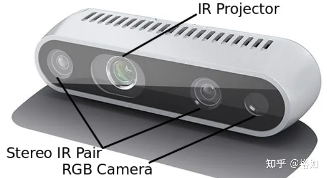
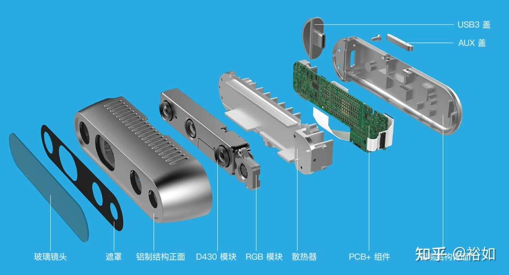
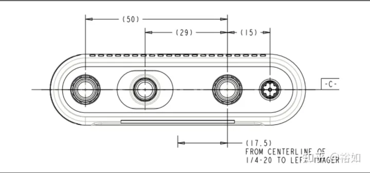

# Realsens D435/435i简介及安装教程
# 一、REALSENSE的基本介绍：

该系列是英特尔的一个系列，目前大多数实验室常用的是435系列。参数手册:

https://www.intelrealsense.com/wp-content/uploads/2020/06/Intel-RealSense-D400-Series-Datasheet-June-2020.pdf

 

 

其是一个RGB-D相机，也就是我们常说的深度相机，目前深度相机的实现原理主要分为三种：分别是结构光，Tof，双目成像。

REALSENSE使用的是结构光的方案。正面的四个摄像头，从左向右以次是左红外相机，红外点阵投射仪，右红外相机，和RGB相机。

结构光的原理是：在激光器外放置一个光栅，激光通过光栅进行投射成像时会发生折射，从而使得激光最终在物体表面上的落点产生位移。当物体距离激光投射器比较近的时候，折射而产生的位移就较小；当物体距离较远时，折射而产生的位移也就会相应的变大。

这时使用一个摄像头来检测采集投射到物体表面上的图样，通过图样的位移变化，就能用算法计算出物体的位置和深度信息，进而复原整个三维空间。最高 1280×720 双目深度分辨率最高 1920×1080 RGB 分辨率最高 90 FPS 深度视频流。深度流与普通 RGB 视频流类似，只不过每个像素点的值不再是 RGB 或灰度值，而是物体相对于相机的距离。只能对相同帧率的 RGB 与深度视频流做同步设置双目 baseline 为 50 mm深度探测范围 0.2 m ~ 10 m深度坐标系以左侧相机为中心（下图中 centerline of 1/4-20 是指三脚架螺丝空的中心）

 